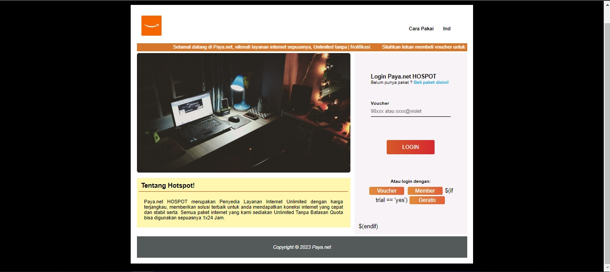

<p align="center">
    
</p>
<h1 align="center">Hospot-Mikrotik</h1>
<h3 align="center">This hospot is build with html</h3>
<h3 align="center">Give this repository a ⭐ if you like it</h3>

Dikembangkan dengan [W3Schools](https://www.w3schools.com/) [Mikrotik](https://www.mikrotik.com/)

## Description

<p align="center">
    
</p>

-   PAYA-NET Hospot is a Website with various functions
-   There are various features available on PAYA-NET hospot
-   Fisrt you need clone this github to your pc
-   Please read full for instalation

## Installation

- Buka CMD, PowerShell atau Terminal

- Clone aplikasi dari github
    ```bash
    git clone https://github.com/MHD1890/Hospot-Mikrotik
    ```

- Pilih folder Hospot-Mikrotik
    ```bash
    Pilih folder hospot mikrotik
    ```

- Login winbox
    ```bash
    Pada menu mikrotik lalu files, seret file Hospot-Mikrotik ke winbox untuk mencopynya
    ```
    
    ```bash
    Seterusnya konfigurasi lah sesuai dengan Hospot keperluan
    ```
    
## Contributing

Silakan Fork Repository lalu lakukan update kode

Jika telah selesai update kode, lakukan Open Pull Request

Jika ada error silakan buat issue baru pada repository# PAYA-NET-Hospot
